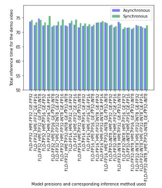

# Computer Pointer Controller
This app allows you to control the mouse cursor by eye gaze, and you can implement using the package as mentioned in below points. It provides an underlying funcitonality for any other appliation which utilizes this eye gaze movement of cursor on screen, such as in personal computers, or wall-mounted devices. This app is developed using Intel's OpenVINO toolkit, and deep-learning models from Intel's Open Model Zoo.

## Project Set Up and Installation
To start with this project, you would need to install OpenVINO toolkit using the following instructions, and it is advised that you create and use a virtual environment for project isolation as it requires specific versions of different libraries listed in dependencies file.

_To install OpenVINO toolkit:_

[Please follow this link and select your OS based OpenVINO toolkit package](https://docs.openvinotoolkit.org/2020.1/index.html)

_To create and use a virtual environemt you can use Anaconda package manager if you have it installed or you can install pretty quickly following the commands [here](https://docs.anaconda.com/anaconda/install/):_

`conda create -n CPC python=3.5` - This will create a virtual environment named as CPC

`conda activate CPC` - This will activate CPC, the virtual environment for you to work in

You would need to place CPC_project directory in your local directory for eg. `/<DIR>/`. Then, you would need to initialize the OpenVINO environment using the following command:

`source /<directory_in_which_you_have_openvino_installed>//bin/setupvars.sh -pyver 3.5`

_To install the dependecies using this command:_

`pip3 install -r /<DIR>/CPC_project/requirements.txt`

_To download the models you can use the following commands:_

```python /<directory_in_which_you_have_openvino_installed>/deployment_tools/open_model_zoo/tools/downloader/downloader.py --name face-detection-adas-binary-0001 --output_dir /<DIR>/CPC_project```

```python /<directory_in_which_you_have_openvino_installed>/deployment_tools/open_model_zoo/tools/downloader/downloader.py --name gaze-estimation-adas-0002 --output_dir /<DIR>/CPC_project```

```python /<directory_in_which_you_have_openvino_installed>/deployment_tools/open_model_zoo/tools/downloader/downloader.py --name landmarks-regression-retail-0009 --output_dir /<DIR>/CPC_project```

```python /<directory_in_which_you_have_openvino_installed>/deployment_tools/open_model_zoo/tools/downloader/downloader.py --name head-pose-estimation-adas-0001 --output_dir /<DIR>/CPC_project```

So, after this initial setup you would be ready to run the app as explained under Demo section.

Project package directory structure:


## Demo
A demo command to run the app on a "CPU" device using all FP32 precision models, except for face detection model which will always use FP32-INT1 as that is the only one present in Open model zoo for that.

_For running Synchronous inference requests:_

```python3 /<DIR>/CPC_project/src/main_sync_infer.py -d CPU -t video -i /<DIR>/CPC_project/bin/demo.mp4 -p FP32 -l FP32 -g FP32 -FDO 1 -FLD 1 -VID 1 -MOVE 1 -path /<DIR>/```
    
_For running Asynchronous inference requests:_

```python3 /<DIR>/CPC_project/src/main_sync_infer.py -d CPU -t video -i /<DIR>/CPC_project/bin/demo.mp4 -p FP32 -l FP32 -g FP32 -FDO 1 -FLD 1 -VID 1 -MOVE 1 -path /<DIR>/```
    
If successful inferencing starts, it will also start printing the frame number along with the output of gaze detection model for that frame.

## Documentation
The description of the arguments required and optional for gaze control application are given below:


## Benchmarks
All inferences are performed on only one core of Intel Xeon CPU @2.30GHz with OS-Ubuntu 16.04.6 LTS (Xenial Xerus).
Both synchronous and asynchronous methods are used for benchmarking along with all possible precisions combinations for all the models are tested for getting the best performance.

Model precision used vs Total Load time for Head Pose Detection model


Model precision used vs Total Load time for Facial Landmarks Detection model


Model precision used vs Total Load time for Gaze Estimation model


Model preisions and corresponding inference method used vs FPS rate for the demo video


Model preisions and corresponding inference method used vs Total time it took to run the inference on demo video


## Results
1. The hightest frame rate of **8.37 FPS** is achieved with **Synchronous** method of inference when the following precisions combination of Facial Landmarks Detection(FLD), Head Pose Estimation(HPE), and Gaze Detection model are used: **FLD-FP32-INT8_HPE-FP16_GE-FP32**.

2. FP32 models loads the fastest, followed by FP16 models with comparable loading time, but the slowest ones are FP32-INT8 models, which takes upto 2x to 7x more time compared to other precisions of the same models.

## Async inference
As discussed above, the performance was found better with synchronous inferencing method.

## Stand Out Suggestions
After iterating over all the combinations of model precisions, I have found that the best performance is estimated when using the FP32-INT8 precision of Facial-Landmarks-Detection model, with FP16 precision of Head-Pose-Estimation model, along with FP32 precision of Gaze-Estimation model.

### Edge Cases
There will be certain situations that will break your inference flow. For instance, lighting changes or multiple people in the frame. Explain some of the edge cases you encountered in your project and how you solved them to make your project more robust.
1. When multiple people with faces detected are detected by the app, it will report it to the user to check for this issue in the video.
2. When the face detection model, or only facial landmarks detection model could not detect a face or facial features respectively, then the app was crashing as for the next models in the pipelines there was no input. 
To resolve this,  I have included the following conditional before implementing the functions like cv2.resize() on any frame:
if np.shape(frame) != () and np.sum(frame) != 0:
